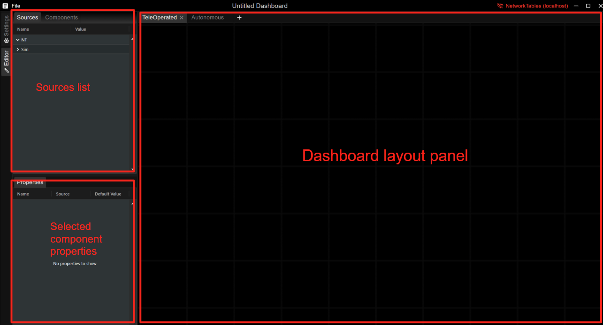
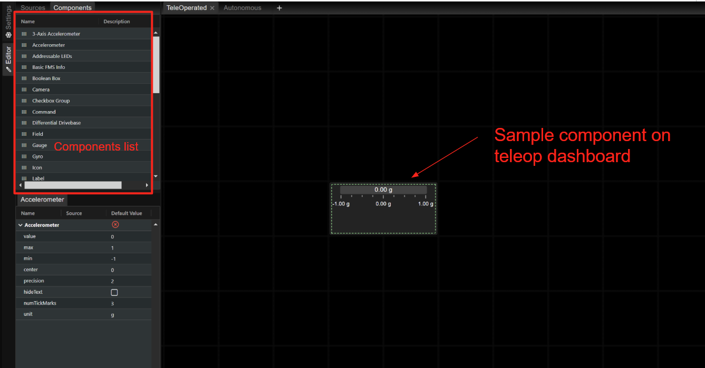
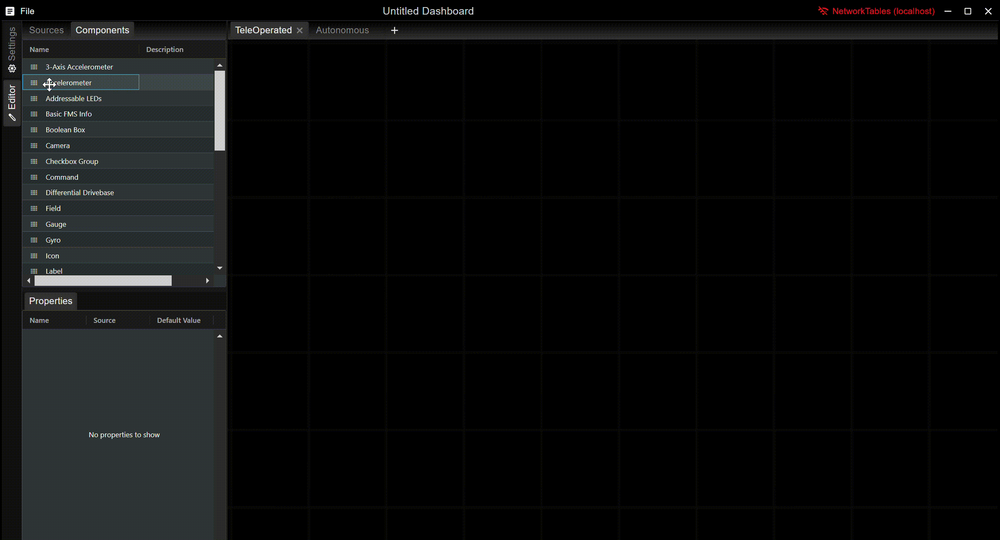
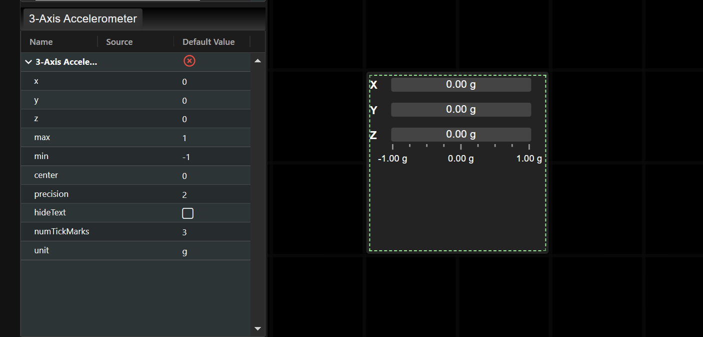
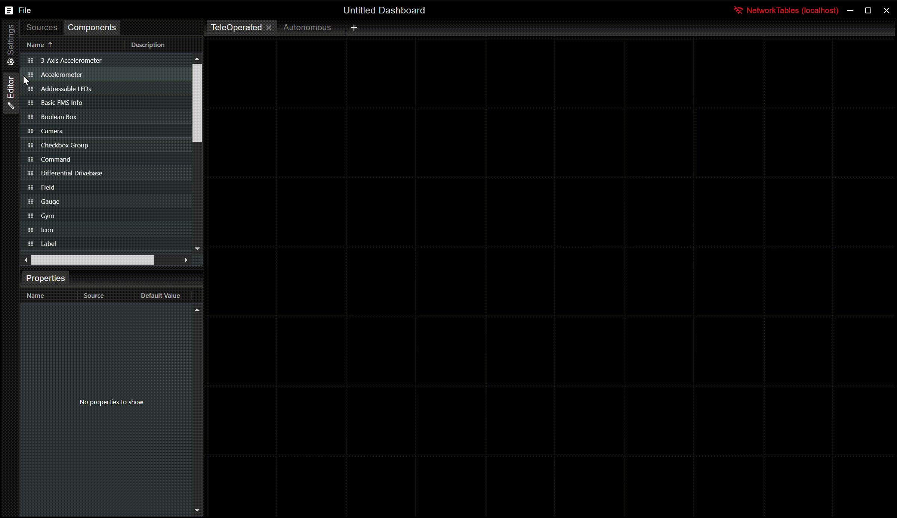
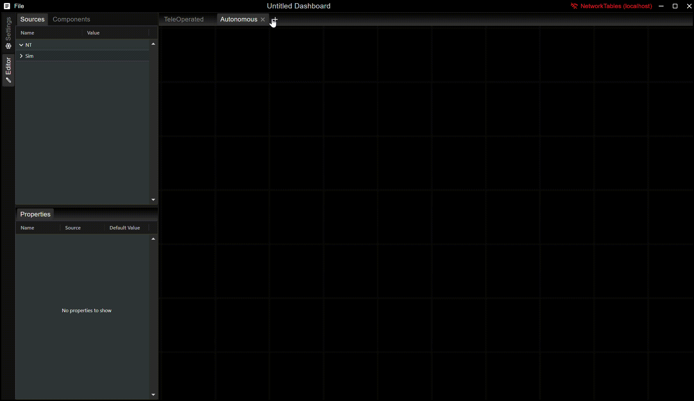
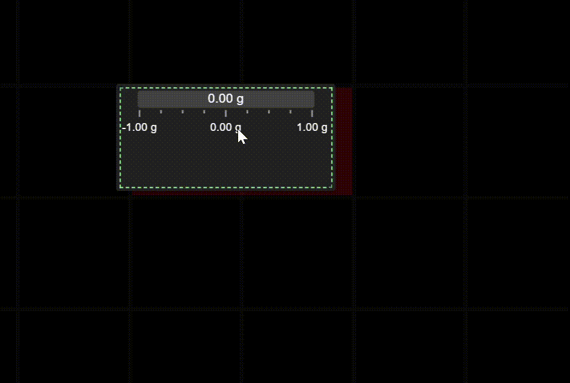
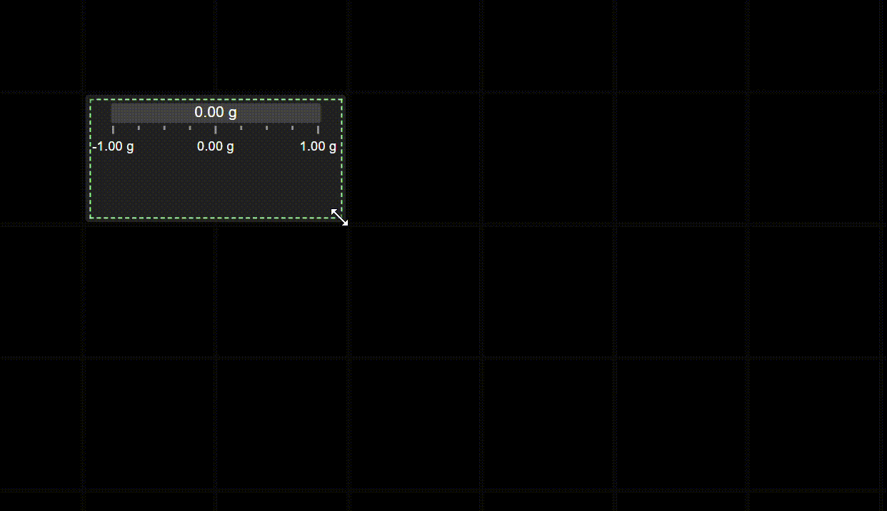
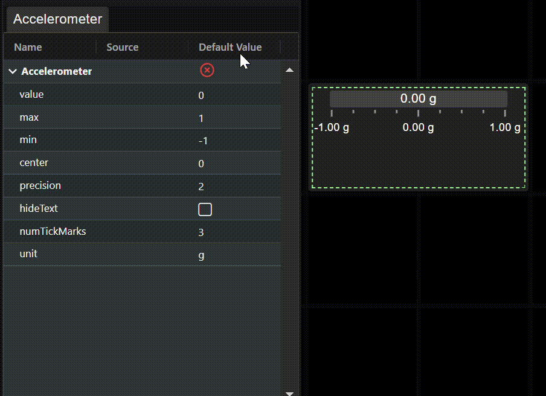

# React FWC Dashboard

## Developing

### Installing

This project uses the pnpm package manager. Please install pnpm first before proceeding: https://pnpm.io/installation

If using vscode the following extensions are recommended:

- [Prettier](https://marketplace.visualstudio.com/items?itemName=esbenp.prettier-vscode): Code formatting
- [CSS Modules](https://marketplace.visualstudio.com/items?itemName=clinyong.vscode-css-modules): Used for autocompleting css modules

To install run in the root directory:
https://github.com/frc-web-components/react-dashboard.gitk

```bash
pnpm install
```

### Running

To run the project locally run in the root directory:

```bash
pnpm dev
```

https://github.com/frc-web-components/react-dashboard.gitk

## Usage

- Adding, Selecting, and Removing Elements
- Tab Management
- Moving and Resizing Components
- Setting Element Properties

## App Layout

When you first open the app, you will see the following panels:



### Adding, Selecting, and Removing Elements

Elements can be added to the dashboard by dragging them from the `Components` tabl on the sidebar to the dashboard:



To select an element, click on it in the dashboard. Its properties will appear in the `Properties` panel in the sidebar.



To delete a component, either press Delete on your keyboard, right click on the component and select "Remove", or click the red `X` in its `Properties` panel.



### Tab Management

By default, each dashboard starts with a TeleOperated tab and an Autonomous tab. If you need more tabs, you can add them with the `+` button. You can remove tabs by clicking the `x` button on the tab handle. You can rename a tab by double-clicking on the tab handle.



### Moving and Resizing Components

Selected elements can be moved by dragging them around their center:



Elements can be resized by dragging their upper left and lower right corners:



### Setting Element Properties

Element behavior changes based on their properties. A selected element's property values can be set in the Properties view. Property values can be changed through their input fields:



## Developing

### Publishing and Releasing

This project uses changesets to manage publishing. More info can be found here: https://pnpm.io/using-changesets
