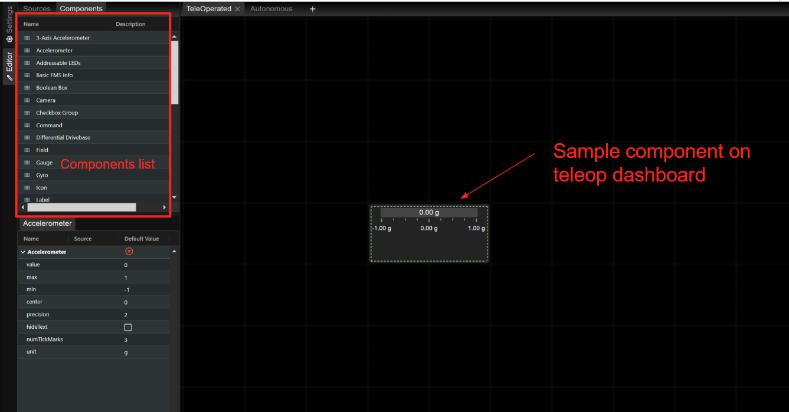
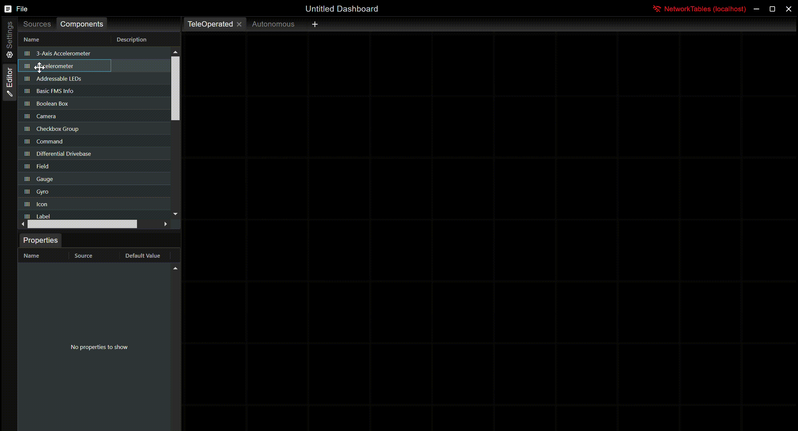
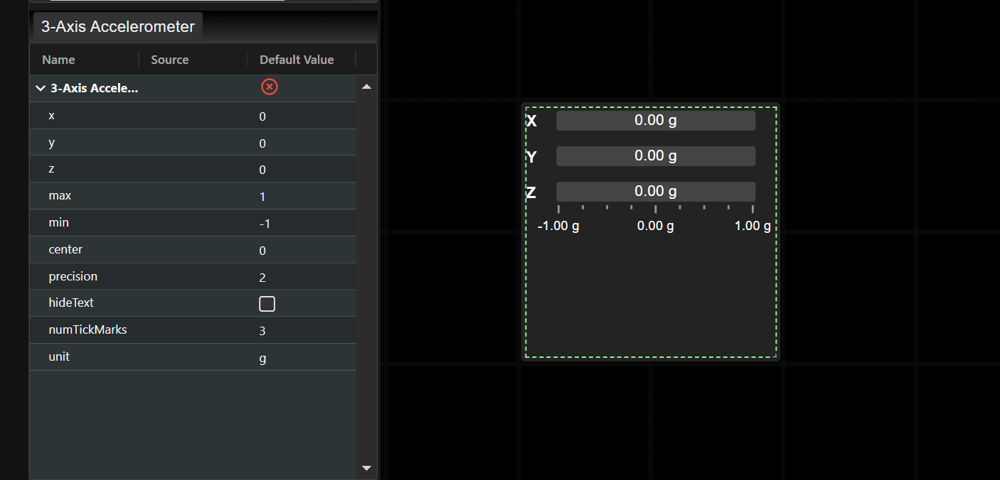
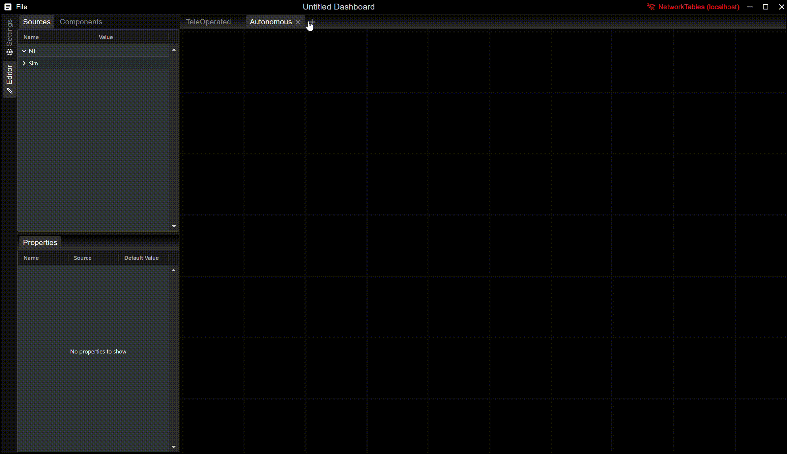

# Dashboard

[<- Home](/README.md)

- [Layout](#layout)
- [Adding, Selecting, and Removing Elements](#adding-selecting-and-removing-elements)
- [Tab Management](#tab-management)
- [Moving and Resizing Components](#moving-and-resizing-components)
- [Setting Element Properties](#setting-element-properties)
- [Property Sources and Robot Communication](#property-sources-and-robot-communication)
- [Source Providers](#source-providers)
- [Themes](#themes)
- [Saving and Opening Dashboards](#saving-and-opening-dashboards)
- [Importing Plugins](#importing-plugins)

## Layout

When you first open the app, you will see the following panels:

## Adding, Selecting, and Removing Elements

Elements can be added to the dashboard by dragging them from the `Components` tabl on the sidebar to the dashboard:

To select an element, click on it in the dashboard. Its properties will appear in the `Properties` panel in the sidebar.

To delete a component, either press Delete on your keyboard, right click on the component and select "Remove", or click the red `X` in its `Properties` panel.

## Tab Management

By default, each dashboard starts with a TeleOperated tab and an Autonomous tab. If you need more tabs, you can add them with the `+` button. You can remove tabs by clicking the `x` button on the tab handle. You can rename a tab by double-clicking on the tab handle.

## Moving and Resizing Components

Selected elements can be moved by dragging them around their center:

Elements can be resized by dragging their upper left and lower right corners:

## Setting Element Properties

Element behavior changes based on their properties. A selected element's property values can be set in the Properties view. Property values can be changed through their input fields:

## Property Sources and Robot Communication

TODO

## Source Providers

TODO

## Themes

TODO

## Saving and Opening Dashboards

TODO

## Importing Plugins

TODO
