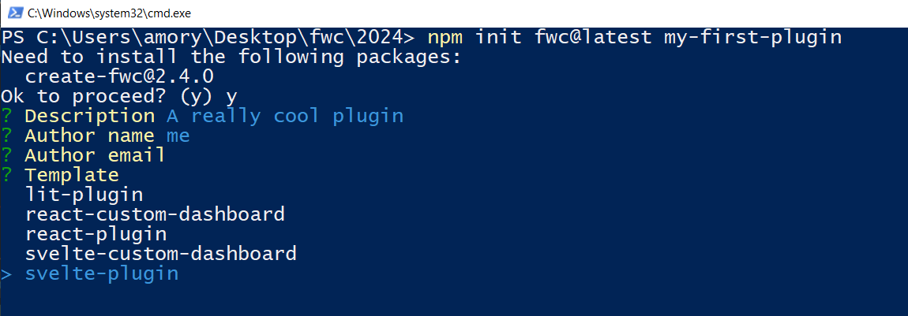
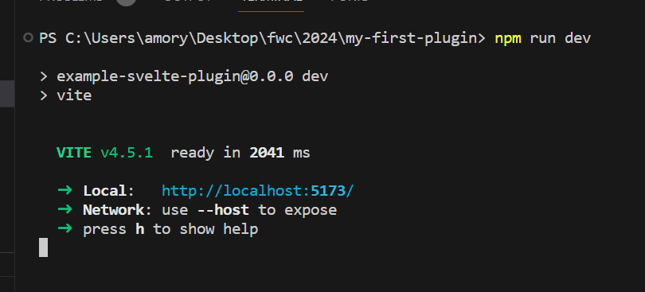
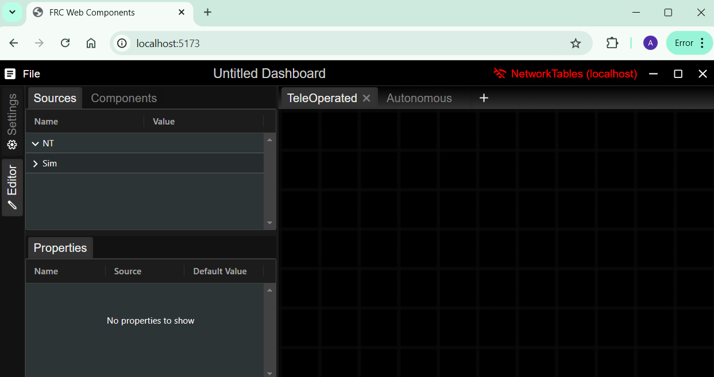
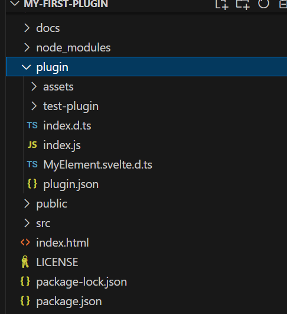
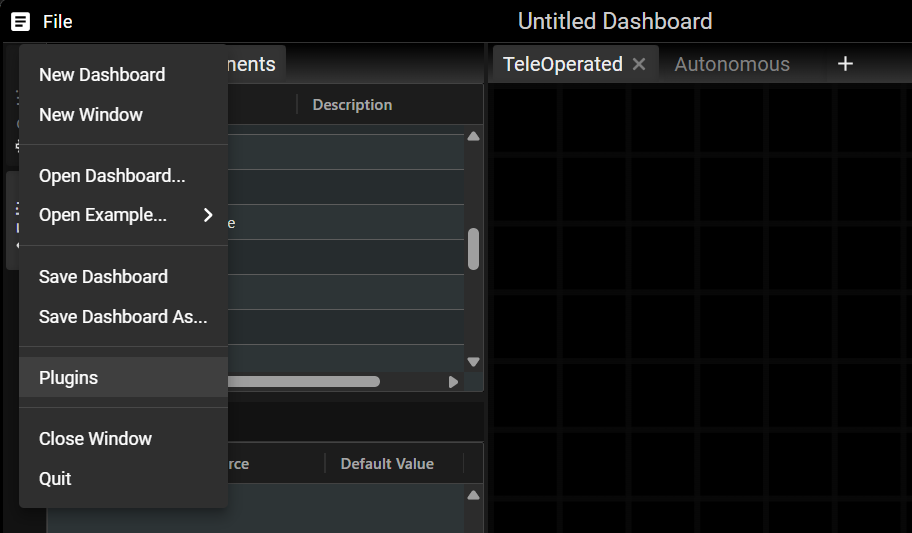
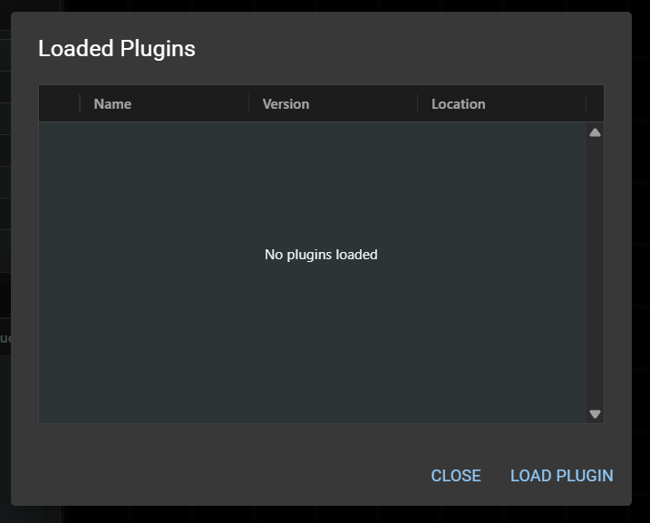
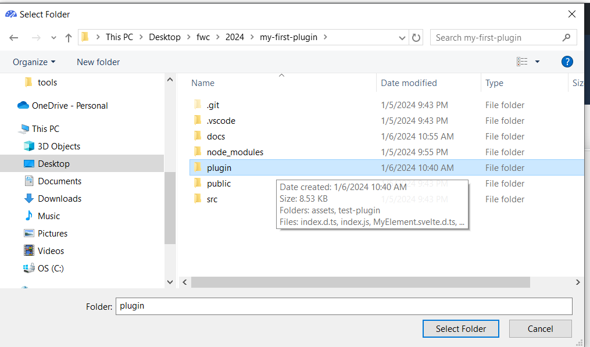
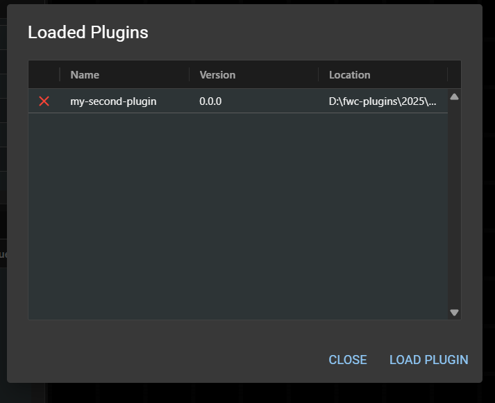

# FWC Plugin with Svelte + TS + Vite

This template should help get you started developing a FWC plugin with Svelte and TypeScript in Vite.

[<- Home](/README.md)

- [Generating plugin](#generating-plugin)
- [Recommended IDE Setup](#recommended-ide-setup)
- [Installing](#installing)
- [Running](#running)
- [Building and importing into dashboard app](#building-and-importing-into-dashboard-app)
- [Theming](#theming)
- [Including Static Assets](#including-static-assets)

## Generating plugin

FWC provides a cli tool which generates a sample plugin that can be used to help get you started with writing your own plugin:

```bash
npm init fwc@latest <name>
```

Note: You'll need <span class="title-ref">node</span> installed to run
the above command: <https://nodejs.org/en/download/>

To get started, open a terminal and enter in the following command:

```bash
npm init fwc@latest my-first-plugin
```

After being prompted with a few questions to help setup your plugin, the plugin project will be created and installed. The cli tool provides templates to create components using [lit](https://lit.dev/), [react](https://react.dev/) or [svelte](https://svelte.dev/):



## Recommended IDE Setup

[VS Code](https://code.visualstudio.com/) + [Svelte](https://marketplace.visualstudio.com/items?itemName=svelte.svelte-vscode).

## Installing

To install run the following command:

```bash
npm install
```

## Running

To run the dashboard in dev mode cd into the directory that was created in the last step and run the following command:

```bash
npm run dev
```

You should see the following in the terminal:



The dashboard should launch automatically in the browser. If not, open it manually using link shown in the terminal. (http://localhost:5173 for me)

You should see the dashboard in the browser:



From here you should be able to navigate to your component which you can add and test in the browser:


## Building and importing into dashboard app

Before the plugin can be imported into the dashboard app the plugin must first be built. Run the following command to build

```bash
npm run build
```

A `plugin` folder should be generated:



> [!WARNING]  
> This folder should not modified manually since your changes will be overwritten whenever the build command is run.

Within the build file you'll find a few important files and folders:

- `index.js` which is the root javascript file which the dashboard app will import.
- `assets` folder which contains images and other static files that your plugin uses. These are copied over from the `public/assets` folder.
- `plugin.json` which contains metadata like the plugin name, description and version used by the dashboard app for display purposes.

To import the plugin open the app and click the `File > Plugins` menu item:



This should open the plugins dialog:



Click `Load Plugin` which open up an open folder dialog. Navigate to your plugin and select the `plugin` folder generated with the `npm run build` command:



You should now see the plugin loaded in the dialog:



The app must be refreshed to view the changes:


The plugin should now be successfully loaded:


## Theming

Theming in the FWC dashboard app is done using [CSS variables](https://developer.mozilla.org/en-US/docs/Web/CSS/Using_CSS_custom_properties).

As an example take the following style rule for the `my-svelte-element` component:

```css
color: white;
```

To make this rule themable change it to the following:

```css
color: var(--my-svelte-element-color, white);
```

`--my-svelte-element-color` is the CSS variable. CSS variables are prefixed with `--`. To ensure uniqueness and to prevent accidentally overwriting existing rules prepend your variable with the element name. `white` is the default value if a theme is not set.

To add per theme rules add the following code:

```typescript
import { addThemeRules } from '@frc-web-components/app';

addThemeRules('dark', {
  '--my-svelte-element-color': 'black',
});

addThemeRules('light', {
  '--my-svelte-element-color': 'white',
});
```

## Including Static Assets

Static assets like such as images should be placed in the `/public/assets` folder. They can be included into the app by calling the `getAssetUrl` function. For example:

```typescript
import { getAssetUrl } from '@frc-web-components/app';

const url: string = getAssetUrl('party.svg');
```

The above URL can then be used as the src of an image element:

```html

```
